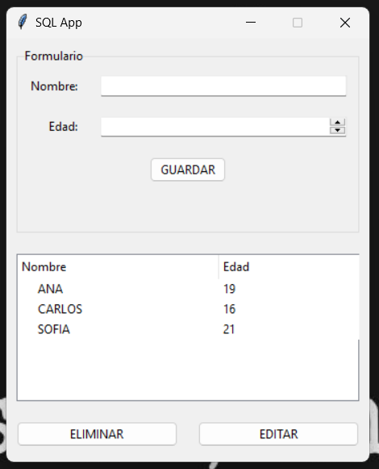

# SQLite CRUD con Tkinter

Este proyecto es una aplicación CRUD simple que utiliza SQLite y Tkinter en Python. La aplicación le permite agregar, ver, editar y eliminar registros de estudiantes de una base de datos SQLite.

Basado en https://www.youtube.com/watch?v=W2kAF9pKPPE



## Características

- Agregar nuevos estudiantes con su nombre y edad.
- Ver la lista de estudiantes en una tabla Treeview.
- Editar registros de estudiantes existentes.
- Eliminar registros de estudiantes.

## Requisitos

- Python 3.x
- Tkinter (generalmente incluido con Python)
- SQLite (generalmente incluido con Python)

## Instalación

1. Clona el repositorio:
   
    ```bash
    git clone https://github.com/PakoMtzR/sqlite_crud_tkinter_example.git
    ```
2. Asegúrate de tener SQLite instalado. Puedes verificar si ya lo tienes instalado ejecutando el siguiente comando:
   
    ```bash
    sqlite3 --version
    ``` 
    Si no tienes SQLite instalado, puedes descargarlo e instalarlo desde la página oficial de [SQLite](https://www.sqlite.org/download.html).

3. Ejecuta la aplicación:
   
    ```bash
    python app.py
    ``` 
    
